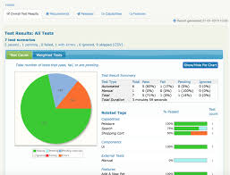

# Archer UI BDD Framewok

[](http://commitizen.github.io/cz-cli/)

## Get Started

#### Pre-requisites

1.NodeJS installed globally in the system.
https://nodejs.org/en/download/

2.Install JDK (>1.8.x)

## Recommanded IDE

VSCode

## Recommanded VSCode Extensions


## Setup Scripts

- Clone the repository into a folder
- Go inside the folder and run following command from terminal/command prompt

```
npm install
```

- All the dependencies from package.json and ambient typings would be installed in node_modules folder.

## One time setup

```
npm run serenity-update
npm run webdriver-update
```

## Run tests

Just run the below command

```
npm run test
```

The above command would trigger tests in chrome and generate Serenity-BDD reports automatically!

> The execution reports would be available in **target/site** folder

## Test Annotation

In this framework, we use 4 types of annotation to group the test cases as per our expectation.

1. @accesibility - To test the accesibility rules [applicable to scenario]
2. @visual - to test the visual regression [applicable to scenario]
3. @smoke - to group test cases for smoke tests [applicable to scenario & feature]
4. @regression - to group test cases for regression tests [applicable to scenario & feature]
5. @jira-epic/feature-id - [applicable to feature]
6. @jira-us-id - [applicable to scenario]

## Run tests(Browser mode)

Multiple browser configurations are available in **config/browser.config** folder and **package.json** has respective scripts to run tests in specific browsers

## Writing Features

> feature files needs to be written in test/e2e/features

```
Feature: Page Login
	As a user, I want to login to the page

	@accessibility
	@smoke
	Scenario: user login with valid credentials
		Given user navigate to the target login page
		And user enter "tomsmith" and "SuperSecretPassword!"
		When user click the login button
		Then user should see the login success message

```

## Writing Page Objects

> UI page objects needs to be written in test/e2e/specs/ui/pageObjects

```ts
import { ElementFinder, element, by } from 'protractor';

class LoginPage {
  public usernameField: ElementFinder;
  public passwordField: ElementFinder;
  public loginBtn: ElementFinder;
  public loginSuccessMsg: ElementFinder;
  public urlRoute: string;

  constructor() {
    this.urlRoute = '/login';
    this.usernameField = element(by.css('#username'));
    this.passwordField = element(by.css('#password'));
    this.loginBtn = element(by.css('#login button'));
    this.loginSuccessMsg = element(by.xpath("//div[contains(@class,'success')]"));
  }
}

export let loginPage = new LoginPage();
```

## Writing Step Functions

> UI page functions needs to be written in test/e2e/specs/ui/stepFunctions

```ts
import { browser } from 'protractor';
import { loginPage } from 'test/e2e/specs/ui/pageObjects';
import { expect } from 'src/support/assert/expect';
import { elemHelper } from 'src/utils';

class LoginFunctions {
  async launchLoginUrl() {
    await browser.get(browser.baseUrl + loginPage.urlRoute);
  }
  async setUserName(userName: string) {
    await elemHelper.sendKeys(loginPage.usernameField, userName);
  }
  async setUserPassword(password: string) {
    await elemHelper.sendKeys(loginPage.passwordField, password);
  }
  async clickLoginBtn() {
    await elemHelper.click(loginPage.loginBtn);
  }
  async checkLoginSuccess() {
    await expect(loginPage.loginSuccessMsg, 'check login success message is present').to.be.present;
  }
}

export let loginFunctions = new LoginFunctions();
```

## Writing Step Definitions

> UI page functions needs to be written in test/e2e/specs/ui/stepDefinitions

```ts
import { loginFunctions } from 'test/e2e/specs/ui/stepFunctions';

export = function performLoginValidations() {
  this.Given(/^user navigate to the target login page$/, async () => {
    loginFunctions.launchLoginUrl();
  });

  this.When(/^user enter "(.*)" and "(.*)"$/, async (username: string, password: string) => {
    await loginFunctions.setUserName(username);
    await loginFunctions.setUserPassword(password);
  });

  this.When(/^user click the login button$/, async () => {
    await loginFunctions.clickLoginBtn();
  });

  this.Then(/^user should see the login success message$/, async () => {
    await loginFunctions.checkLoginSuccess();
  });
};
```

## Cucumber Hooks

Following method takes screenshot on failure of each scenario

```ts
import { browser } from "protractor";

export= function(){
this.Before({timeout: 100 * 1000}, async function(scenario)  {
    await browser.manage().window().maximize();
    await browser.get(browser.baseUrl);
});

```

## HTML Reports

Currently this project has been integrated with Serenity-JS. Reports produced are user-friendly and BDD structured.



## Contributions

For contributors who want to improve this repo by contributing some code, reporting bugs, issues or improving documentation - PR's are highly welcome, please maintain the coding style , folder structure , detailed description of documentation and bugs/issues with examples if possible.

## License

```
RSA License

Copyright (c) 2019
```
